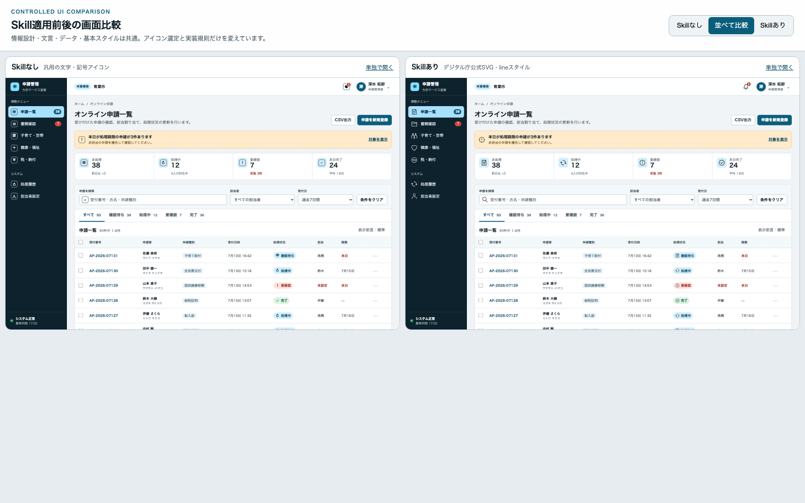

# Skill適用前後の比較結果

## 比較条件

- 題材: 自治体職員向けオンライン申請管理画面
- 共通要素: 情報設計、文言、8件の申請データ、配色、レイアウト、レスポンシブ挙動、検索・タブ・行選択機能
- Baseline: skillの検索ツール、公式素材、実装規則を使用せず、文字と一般的な記号をアイコンとして使用
- Skill版: `digital-agency-illustration-icons` で用途を検索し、必要な公式line SVGだけをコピーして実装
- デスクトップ比較サイズ: 1440 × 920px
- モバイル確認サイズ: 390 × 844px

## 観察結果

### Skill版で改善した点

1. サイドバーの「申請」「書類」「家族」「健康」「税」について、文字記号ではなく意味に対応した図像になった。
2. すべて公式の24px line SVGを用いるため、線幅、余白、視覚重量が揃った。
3. ラベル付きアイコンを `alt=""` とし、見えているラベルとの読み上げ重複を避けられた。
4. アイコン単体の通知ボタンに `aria-label` と44 × 44 CSS pxの操作領域を設定できた。
5. SVGの1:1比率を保ち、用途ごとに必要な11ファイルだけをコピーした。

### Baseline版に残った問題

1. 「申」「家」「￥」など文字と記号が混在し、見た目と抽象度が揃わない。
2. 同じ囲みを付けても、字形ごとの視覚重量と意味の分かりやすさに差がある。
3. 通知ボタンは40 × 40 CSS pxで、`title` のみを使っている。

### Skill自体の改善候補

検索ツールへ `家族 健康 税金 通知 検索` のように複数の独立概念を一度に渡すと、候補が0件になった。単一概念ずつの検索は期待通りに動作した。今後は次のいずれかが望ましい。

また、`確認待ち` のようなUI状態語でも直接候補が出ないため、最終的には申請内容を表す `application` を選び、処理中の `update` と区別した。

- クエリを独立概念へ分割して、それぞれの上位候補を返す
- 全語一致ではなくOR検索モードを追加する
- 0件時に単語別の再検索候補を提示する

## 検証上の制約

同一エージェントが両版を作成しているため、完全なブラインド試験ではない。比較の汚染を減らすため、Baseline版ではskillの検索、公式素材、固有のアクセシビリティ規則を適用せず、両版のDOMとデータは可能な限り共有した。
